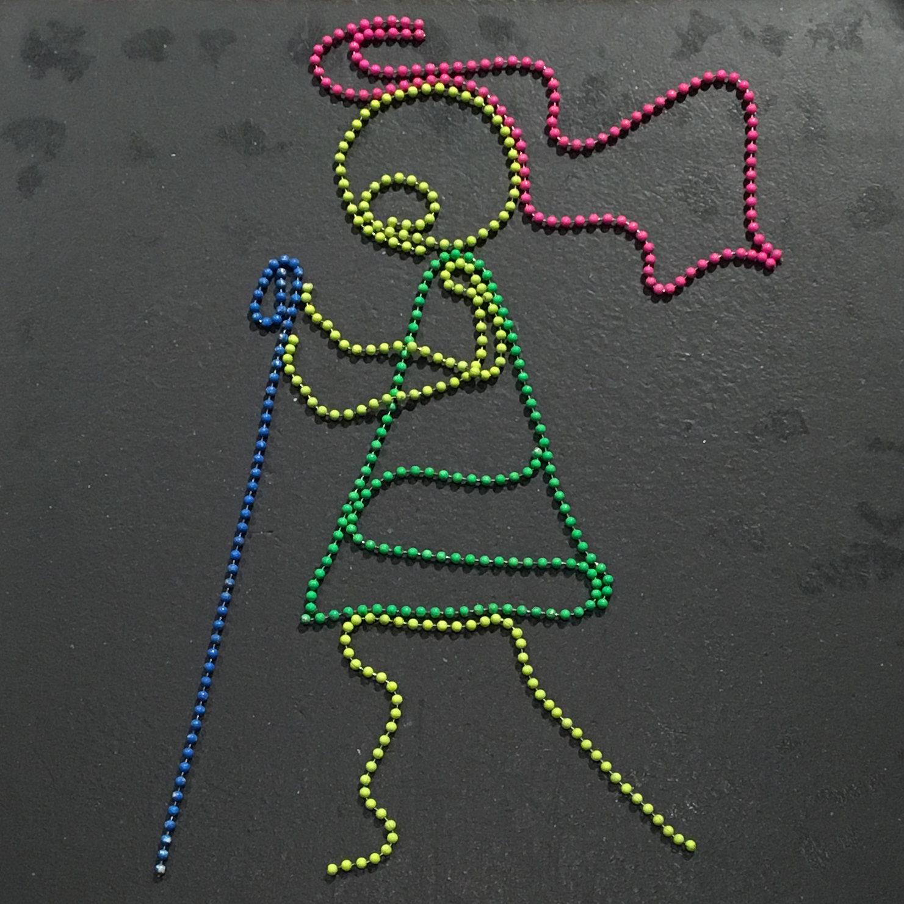

Really just to try what happens to images stored locally and on the web:
 - locally as a file added to the repo
 - on the web a publicly accessible image (as opposed to a CDN hosted image)


**Contents**

[TOC]

_NOTE: this will include a table of contents when rendered on the site._


### Images:




And now the rest of the .md template:

### Motivation:

*NOTE: optimize in this section for **context setting**, as specifically as you
can. For instance, this post is generally a set of standards for work in the
repo. The specific motivation is to have least friction to current workflow
while being able to painlessly aggregate it later.*

The knowledge repo was created to consolidate work from across the A-team that
is currently scattered in emails, blogposts, and keynotes, so that people didn't
redo their work. For example, if one team member did a lot of interesting work
on search intent, we want other A-teamers to find and use that work instead of
reinventing the wheel by doing their own version of search intent. To reach that
goal, there are two requirements:

 - A-team work needs to be in this repo
 - A-teamers need to be able to find work relevant to what they're doing, so
they know if it's be done before

In order to balance these goals, the editors have decided to optimize for least
friction to people's current workflows in the short-term, while only requiring
the amount of structure that will allow A-teamers to navigate and slice through
the growing library of work.

### This Section Says Exactly This Takeaway

```python
    import numpy as np
    
    x = np.linspace(0, 3*np.pi, 500)
    plot_data = dict()
    plot_data["x"] = x
    plot_data["y"] = np.sin(x**2)
    
    from ggplot import *
    ggplot(aes(x='date', y='beef'), data=meat) + \
            geom_point(color='lightblue') + \
            stat_smooth(span=.15, color='black', se=True) + \
            ggtitle("Put enough labeling in your graph to be understood on its own") + \
            xlab("you definitely need axis labels") + \
            ylab("both of them")
```


*NOTE: in graphs, optimize for being able to **stand alone**. As we aggregate
and put things in keynote, we want to not have to recreate and add code to each
plot to make it understandable without the entire post around it. When we
compare this plot to other people's from other posts, will it be understandable
without several paragraphs?*

### Putting Big Bold Headers with Clear Takeaways Will Help Us Aggregate Later

At some point, once we have a decent nest egg of work from A-teamers, we are
going to revisit the repo and try to aggregate the work into
'collective_knowledge' work. Currently, people output work on a fairly ad-hoc,
itemized basis, perhaps with several posts all related to a similar topic. After
3-6 months, we want to put these points in conversation, to produce higher level
conversations that may be more consumable across the company.

The easier it is to know exactly what each section says, the faster it will be
to parse through all the sections and focus on which slices of the post relate
to a given conversation. Tags help, but I'd rather not have to read every single
detail of every post tagged with 'search intent' to know exactly what relates to
a later conversation.

### Next Steps

As we go forward with this work, we're eventually going to want to aggregate
work and put posts in conversation. It's really helpful to have a communication
chain when doing this. With this section, we can tell where the work ended with
one person, and whether someone else's work can be linked.

### Appendix

Put all the stuff here that is not necessary for supporting the points above.
Good place for documentation without distraction.
